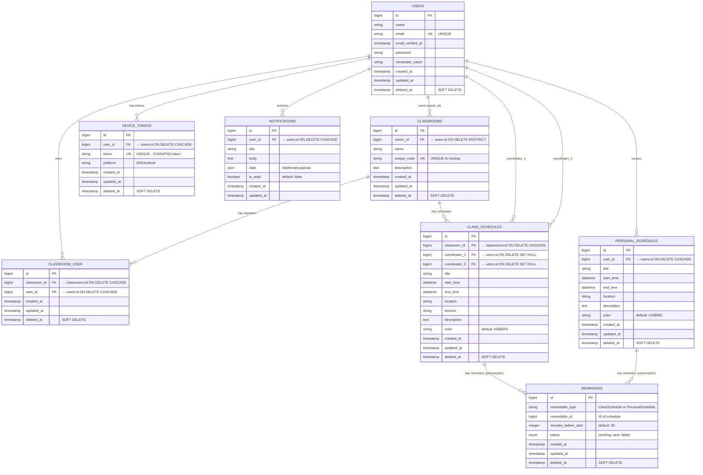
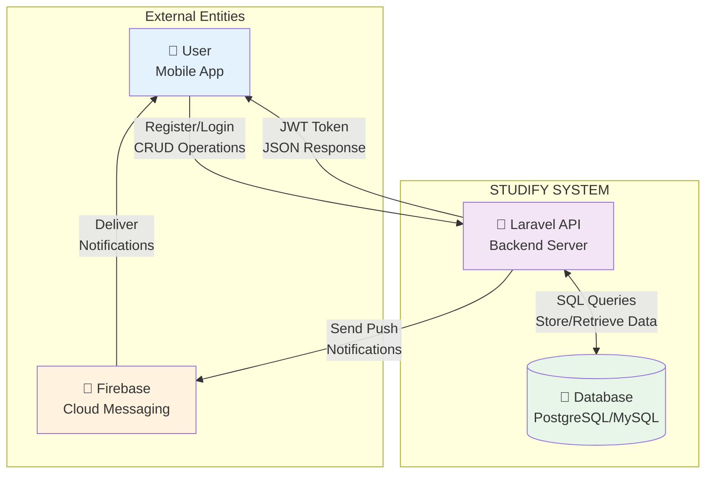
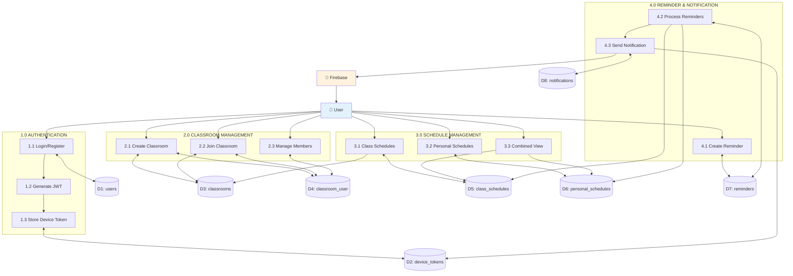
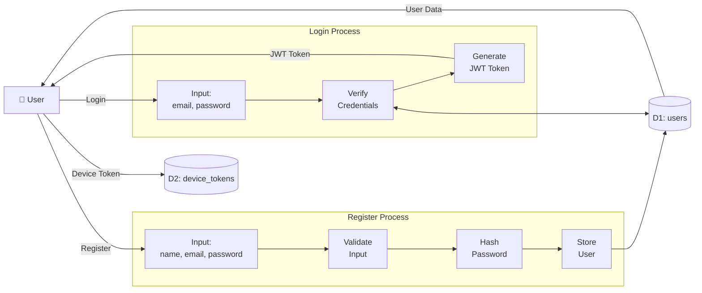
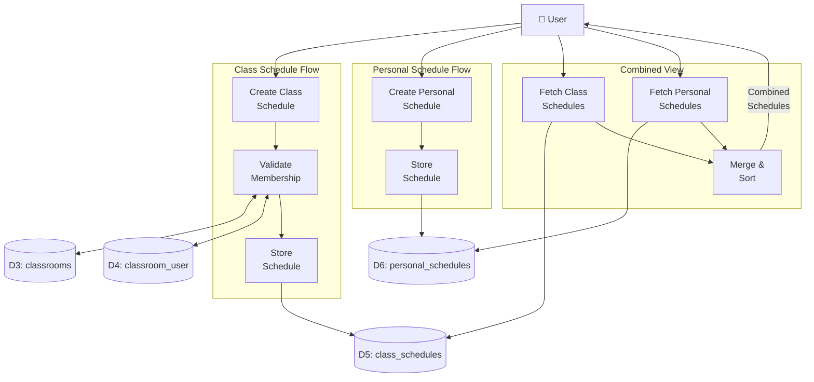
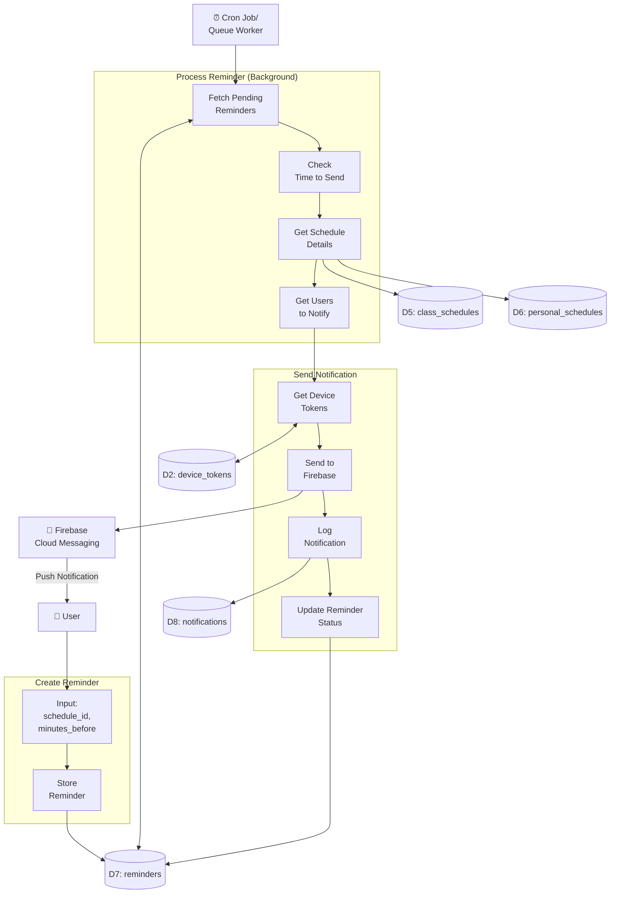

# STUDIFY - ERD Visual (Mermaid Diagram)

## 📊 Entity Relationship Diagram (ERD)

Diagram ini dapat di-render di GitHub, VS Code (dengan extension Mermaid), atau di https://mermaid.live

---

## 🔄 Data Flow Diagram (DFD) - Level 0

---

## 🔄 Data Flow Diagram (DFD) - Level 1

---

## 🔄 DFD Level 2 - Authentication Flow

---

## 🔄 DFD Level 2 - Schedule Management Flow

---

## 🔄 DFD Level 2 - Reminder & Notification Flow

---

## 📊 Cardinality Summary

| Relationship | From | To | Type |
|-------------|------|-----|------|
| User owns Classrooms | USERS | CLASSROOMS | 1:N |
| User joins Classrooms | USERS | CLASSROOMS | N:M (via classroom_user) |
| Classroom has Schedules | CLASSROOMS | CLASS_SCHEDULES | 1:N |
| User creates Personal Schedules | USERS | PERSONAL_SCHEDULES | 1:N |
| User coordinates Schedules | USERS | CLASS_SCHEDULES | 1:N (coord_1, coord_2) |
| Schedule has Reminders | SCHEDULES | REMINDERS | 1:N (polymorphic) |
| User has Device Tokens | USERS | DEVICE_TOKENS | 1:N |
| User receives Notifications | USERS | NOTIFICATIONS | 1:N |

---

## 🎯 Key Features Visible in ERD/DFD

### ✅ Multi-tenancy via Classrooms
- Users can own multiple classrooms
- Users can join multiple classrooms as members
- Proper separation of data per classroom

### ✅ Flexible Scheduling
- Class schedules tied to classrooms
- Personal schedules independent
- Combined view for unified calendar

### ✅ Collaborative Features
- Dual coordinators per class schedule
- Classroom ownership transfer
- Member management

### ✅ Notification System
- Polymorphic reminders (works for both schedule types)
- Push notification via Firebase
- Notification history tracking

### ✅ Data Integrity
- Soft deletes for audit trail
- Proper cascade/restrict rules
- Unique constraints for business logic

---

**Cara Melihat Diagram Mermaid:**
1. Buka file ini di GitHub - diagram otomatis ter-render
2. Install extension "Markdown Preview Mermaid Support" di VS Code
3. Copy paste ke https://mermaid.live untuk edit/export
4. Export ke PNG/SVG untuk dokumentasi

**Generated**: December 17, 2025
